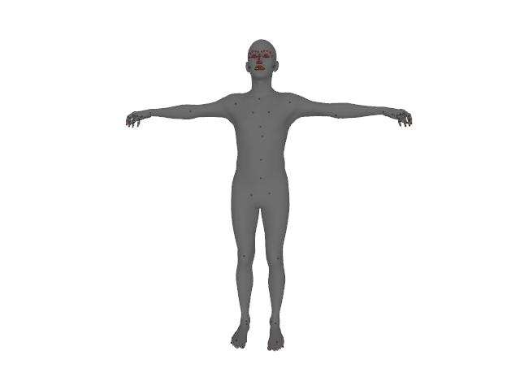

<<<<<<< HEAD
## Expressive Body Capture: 3D Hands, Face, and Body from a Single Image

[[Project Page](https://smpl-x.is.tue.mpg.de/)] 
[[Paper](https://ps.is.tuebingen.mpg.de/uploads_file/attachment/attachment/497/SMPL-X.pdf)]
=======
## SMPL-X:  A new joint 3D model of the human body, face and hands together

[[Paper Page](https://smpl-x.is.tue.mpg.de)] [[Paper](https://ps.is.tuebingen.mpg.de/uploads_file/attachment/attachment/497/SMPL-X.pdf)]
>>>>>>> a27df5a10e881f43ea8a694c47919ecdd399cfdd
[[Supp. Mat.](https://ps.is.tuebingen.mpg.de/uploads_file/attachment/attachment/498/SMPL-X-supp.pdf)]


## Table of Contents
  * [License](#license)
  * [Description](#description)
<<<<<<< HEAD
    * [Fitting](#fitting)
    * [Different Body Models](#different-body-models)
    * [Visualizing Results](#visualizing-results)
  * [Dependencies](#dependencies)
=======
  * [News](#news)
  * [Installation](#installation)
  * [Downloading the model](#downloading-the-model)
  * [Loading SMPL-X, SMPL+H and SMPL](#loading-smpl-x-smplh-and-smpl) 
    * [SMPL and SMPL+H setup](#smpl-and-smplh-setup)
    * [Model loading](https://github.com/vchoutas/smplx#model-loading)
  * [MANO and FLAME correspondences](#mano-and-flame-correspondences) 
  * [Example](#example)
  * [Modifying the global pose of the model](#modifying-the-global-pose-of-the-model)
>>>>>>> a27df5a10e881f43ea8a694c47919ecdd399cfdd
  * [Citation](#citation)
  * [Acknowledgments](#acknowledgments)
  * [Contact](#contact)

<<<<<<< HEAD

=======
>>>>>>> a27df5a10e881f43ea8a694c47919ecdd399cfdd
## License

Software Copyright License for **non-commercial scientific research purposes**.
Please read carefully the [terms and conditions](https://github.com/vchoutas/smplx/blob/master/LICENSE) and any accompanying documentation before you download and/or use the SMPL-X/SMPLify-X model, data and software, (the "Model & Software"), including 3D meshes, blend weights, blend shapes, textures, software, scripts, and animations. By downloading and/or using the Model & Software (including downloading, cloning, installing, and any other use of this github repository), you acknowledge that you have read these terms and conditions, understand them, and agree to be bound by them. If you do not agree with these terms and conditions, you must not download and/or use the Model & Software. Any infringement of the terms of this agreement will automatically terminate your rights under this [License](./LICENSE).

## Disclaimer

<<<<<<< HEAD
The original images used for the figures 1 and 2 of the paper can be found in [this link](https://www.gettyimages.de/search/stack/546047069#). 
=======
The original images used for the figures 1 and 2 of the paper can be found in this link. 
>>>>>>> a27df5a10e881f43ea8a694c47919ecdd399cfdd
The images in the paper are used under license from gettyimages.com.
We have acquired the right to use them in the publication, but redistribution is not allowed.
Please follow the instructions on the given link to acquire right of usage.
Our results are obtained on the 483 × 724 pixels resolution of the original images.

## Description

<<<<<<< HEAD
This repository contains the fitting code used for the experiments in [Expressive Body Capture: 3D Hands, Face, and Body from a Single Image](https://smpl-x.is.tue.mpg.de/).

### Fitting 
Run the following command to execute the code:
```Shell
python smplifyx/main.py --config cfg_files/fit_smplx.yaml 
    --data_folder DATA_FOLDER 
    --output_folder OUTPUT_FOLDER 
    --visualize="True/False"
    --model_folder MODEL_FOLDER
    --vposer_ckpt VPOSER_FOLDER
    --part_segm_fn smplx_parts_segm.pkl
```
where the `DATA_FOLDER` should contain two subfolders, *images*, where the
images are located, and *keypoints*, where the OpenPose output should be
stored.

### Different Body Models

To fit [SMPL](http://smpl.is.tue.mpg.de/) or [SMPL+H](http://mano.is.tue.mpg.de), replace the *yaml* configuration file 
with either *fit_smpl.yaml* or *fit_smplx.yaml*, i.e.:
 * for SMPL:
 ```Shell
 python smplifyx/main.py --config cfg_files/fit_smpl.yaml 
    --data_folder DATA_FOLDER 
    --output_folder OUTPUT_FOLDER 
    --visualize="True/False"
    --model_folder MODEL_FOLDER
    --vposer_ckpt VPOSER_FOLDER
 ```
  * for SMPL+H:
 ```Shell
 python smplifyx/main.py --config cfg_files/fit_smplh.yaml 
    --data_folder DATA_FOLDER 
    --output_folder OUTPUT_FOLDER 
    --visualize="True/False"
    --model_folder MODEL_FOLDER
    --vposer_ckpt VPOSER_FOLDER
 ```
 
### Visualizing Results

To visualize the results produced by the method you can run the following script:
```Shell
python smplifyx/render_results.py --mesh_fns OUTPUT_MESH_FOLDER
```
where *OUTPUT_MESH_FOLDER* is the folder that contains the resulting meshes.

## Dependencies

Follow the installation instructions for each of the following before using the
fitting code.

1. [PyTorch](https://pytorch.org/)
2. [SMPL-X](https://github.com/vchoutas/smplx)
3. [VPoser](https://github.com/nghorbani/HumanBodyPrior)
4. [Homogenus](https://github.com/nghorbani/homogenus)

### Optional Dependencies

1. [PyTorch Mesh self-intersection](https://github.com/vchoutas/torch-mesh-isect) for interpenetration penalty 
   * Download the per-triangle part segmentation: [smplx_parts_segm.pkl](https://owncloud.tuebingen.mpg.de/index.php/s/MWnr8Kso4K8T8at)
1. [Trimesh](https://trimsh.org/) for loading triangular meshes
1. [Pyrender](https://pyrender.readthedocs.io/) for visualization

The code has been tested with Python 3.6, CUDA 10.0, CuDNN 7.3 and PyTorch 1.0 on Ubuntu 18.04. 

## Citation

If you find this Model & Software useful in your research we would kindly ask you to cite:

```
@inproceedings{SMPL-X:2019,
  title = {Expressive Body Capture: 3D Hands, Face, and Body from a Single Image},
  author = {Pavlakos, Georgios and Choutas, Vasileios and Ghorbani, Nima and Bolkart, Timo and Osman, Ahmed A. A. and Tzionas, Dimitrios and Black, Michael J.},
  booktitle = {Proceedings IEEE Conf. on Computer Vision and Pattern Recognition (CVPR)},
  year = {2019}
}
```

## Acknowledgments

### LBFGS with Strong Wolfe Line Search

The LBFGS optimizer with Strong Wolfe Line search is taken from this [Pytorch pull request](https://github.com/pytorch/pytorch/pull/8824). Special thanks to 
[Du Phan](https://github.com/fehiepsi) for implementing this. 
We will update the repository once the pull request is merged.

## Contact
The code of this repository was implemented by [Vassilis Choutas](mailto:vassilis.choutas@tuebingen.mpg.de) and
[Georgios Pavlakos](mailto:pavlakos@seas.upenn.edu).

For questions, please contact [smplx@tue.mpg.de](mailto:smplx@tue.mpg.de). 

For commercial licensing (and all related questions for business applications), please contact [ps-licensing@tue.mpg.de](mailto:ps-licensing@tue.mpg.de).
=======
*SMPL-X* (SMPL eXpressive) is a unified body model with shape parameters trained jointly for the
face, hands and body. *SMPL-X* uses standard vertex based linear blend skinning with learned corrective blend
shapes, has N = 10, 475 vertices and K = 54 joints,
which include joints for the neck, jaw, eyeballs and fingers. 
SMPL-X is defined by a function M(θ, β, ψ), where θ is the pose parameters, β the shape parameters and
ψ the facial expression parameters.

## News

- 3 November 2020: We release the code to transfer between the models in the
  SMPL family. For more details on the code, go to this [readme
  file](./transfer_model/README.md). A detailed explanation on how the mappings
  were extracted can be found [here](./transfer_model/docs/transfer.md).
- 23 September 2020: A UV map is now available for SMPL-X, please check the
  Downloads section of the website.
- 20 August 2020: The full shape and expression space of SMPL-X are now available.

## Installation

To install the model please follow the next steps in the specified order:
1. To install from PyPi simply run: 
  ```Shell
  pip install smplx[all]
  ```
2. Clone this repository and install it using the *setup.py* script: 
```Shell
git clone https://github.com/vchoutas/smplx
python setup.py install
```

## Downloading the model

To download the *SMPL-X* model go to [this project website](https://smpl-x.is.tue.mpg.de) and register to get access to the downloads section. 

To download the *SMPL+H* model go to [this project website](http://mano.is.tue.mpg.de) and register to get access to the downloads section. 

To download the *SMPL* model go to [this](http://smpl.is.tue.mpg.de) (male and female models) and [this](http://smplify.is.tue.mpg.de) (gender neutral model) project website and register to get access to the downloads section. 

## Loading SMPL-X, SMPL+H and SMPL

### SMPL and SMPL+H setup

The loader gives the option to use any of the SMPL-X, SMPL+H, SMPL, and MANO models. Depending on the model you want to use, please follow the respective download instructions. To switch between MANO, SMPL, SMPL+H and SMPL-X just change the *model_path* or *model_type* parameters. For more details please check the docs of the model classes.
Before using SMPL and SMPL+H you should follow the instructions in [tools/README.md](./tools/README.md) to remove the
Chumpy objects from both model pkls, as well as merge the MANO parameters with SMPL+H.

### Model loading 

You can either use the [create](https://github.com/vchoutas/smplx/blob/c63c02b478c5c6f696491ed9167e3af6b08d89b1/smplx/body_models.py#L54)
function from [body_models](./smplx/body_models.py) or directly call the constructor for the 
[SMPL](https://github.com/vchoutas/smplx/blob/c63c02b478c5c6f696491ed9167e3af6b08d89b1/smplx/body_models.py#L106), 
[SMPL+H](https://github.com/vchoutas/smplx/blob/c63c02b478c5c6f696491ed9167e3af6b08d89b1/smplx/body_models.py#L395) and 
[SMPL-X](https://github.com/vchoutas/smplx/blob/c63c02b478c5c6f696491ed9167e3af6b08d89b1/smplx/body_models.py#L628) model. The path to the model can either be the path to the file with the parameters or a directory with the following structure:
```bash
models
├── smpl
│   ├── SMPL_FEMALE.pkl
│   └── SMPL_MALE.pkl
│   └── SMPL_NEUTRAL.pkl
├── smplh
│   ├── SMPLH_FEMALE.pkl
│   └── SMPLH_MALE.pkl
├── mano
|   ├── MANO_RIGHT.pkl
|   └── MANO_LEFT.pkl
└── smplx
    ├── SMPLX_FEMALE.npz
    ├── SMPLX_FEMALE.pkl
    ├── SMPLX_MALE.npz
    ├── SMPLX_MALE.pkl
    ├── SMPLX_NEUTRAL.npz
    └── SMPLX_NEUTRAL.pkl
```


## MANO and FLAME correspondences

The vertex correspondences between SMPL-X and MANO, FLAME can be downloaded
from [the project website](https://smpl-x.is.tue.mpg.de). If you have extracted
the correspondence data in the folder *correspondences*, then use the following
scripts to visualize them:

1. To view MANO correspondences run the following command:

```
python examples/vis_mano_vertices.py --model-folder $SMPLX_FOLDER --corr-fname correspondences/MANO_SMPLX_vertex_ids.pkl
```

2. To view FLAME correspondences run the following command:

```
python examples/vis_flame_vertices.py --model-folder $SMPLX_FOLDER --corr-fname correspondences/SMPL-X__FLAME_vertex_ids.npy
```

## Example

After installing the *smplx* package and downloading the model parameters you should be able to run the *demo.py*
script to visualize the results. For this step you have to install the [pyrender](https://pyrender.readthedocs.io/en/latest/index.html) and [trimesh](https://trimsh.org/) packages.

`python examples/demo.py --model-folder $SMPLX_FOLDER --plot-joints=True --gender="neutral"`



## Modifying the global pose of the model

If you want to modify the global pose of the model, i.e. the root rotation and
translation, to a new coordinate system for example, you need to take into
account that the model rotation uses the pelvis as the center of rotation. A
more detailed description can be found in the following
[link](https://www.dropbox.com/scl/fi/zkatuv5shs8d4tlwr8ecc/Change-parameters-to-new-coordinate-system.paper?dl=0&rlkey=lotq1sh6wzkmyttisc05h0in0).
If something is not clear, please let me know so that I can update the
description.

## Citation

Depending on which model is loaded for your project, i.e. SMPL-X or SMPL+H or SMPL, please cite the most relevant work below, listed in the same order:

```
@inproceedings{SMPL-X:2019,
    title = {Expressive Body Capture: 3D Hands, Face, and Body from a Single Image},
    author = {Pavlakos, Georgios and Choutas, Vasileios and Ghorbani, Nima and Bolkart, Timo and Osman, Ahmed A. A. and Tzionas, Dimitrios and Black, Michael J.},
    booktitle = {Proceedings IEEE Conf. on Computer Vision and Pattern Recognition (CVPR)},
    year = {2019}
}
```

```
@article{MANO:SIGGRAPHASIA:2017,
    title = {Embodied Hands: Modeling and Capturing Hands and Bodies Together},
    author = {Romero, Javier and Tzionas, Dimitrios and Black, Michael J.},
    journal = {ACM Transactions on Graphics, (Proc. SIGGRAPH Asia)},
    volume = {36},
    number = {6},
    series = {245:1--245:17},
    month = nov,
    year = {2017},
    month_numeric = {11}
  }
```

```
@article{SMPL:2015,
    author = {Loper, Matthew and Mahmood, Naureen and Romero, Javier and Pons-Moll, Gerard and Black, Michael J.},
    title = {{SMPL}: A Skinned Multi-Person Linear Model},
    journal = {ACM Transactions on Graphics, (Proc. SIGGRAPH Asia)},
    month = oct,
    number = {6},
    pages = {248:1--248:16},
    publisher = {ACM},
    volume = {34},
    year = {2015}
}
```

This repository was originally developed for SMPL-X / SMPLify-X (CVPR 2019), you might be interested in having a look: [https://smpl-x.is.tue.mpg.de](https://smpl-x.is.tue.mpg.de).

## Acknowledgments

### Facial Contour

Special thanks to [Soubhik Sanyal](https://github.com/soubhiksanyal) for sharing the Tensorflow code used for the facial
landmarks.

## Contact
The code of this repository was implemented by [Vassilis Choutas](vassilis.choutas@tuebingen.mpg.de).

For questions, please contact [smplx@tue.mpg.de](smplx@tue.mpg.de).

For commercial licensing (and all related questions for business applications), please contact [ps-licensing@tue.mpg.de](ps-licensing@tue.mpg.de).
>>>>>>> a27df5a10e881f43ea8a694c47919ecdd399cfdd
